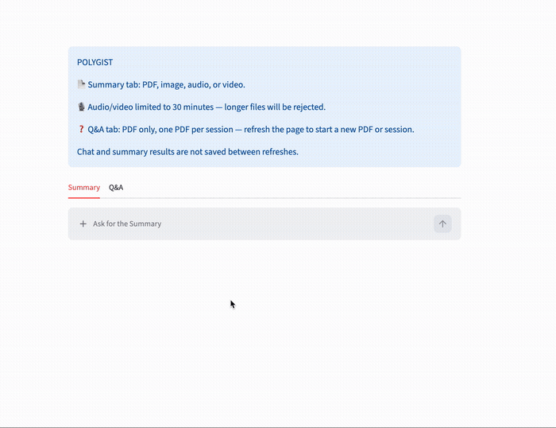
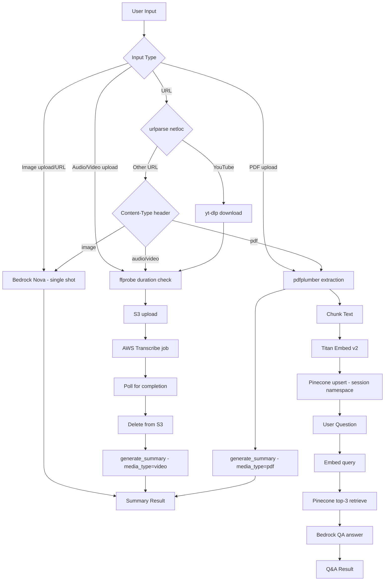

# Polygist

A multimodal summarization app built with Streamlit. Upload a PDF, image, audio/video file, or paste a URL (including YouTube) and get an AI-generated summary — or ask questions against a PDF using RAG.

## Features

- **Summary tab** — supports PDF, image, audio, video, and direct URLs (including YouTube)
- **Q&A tab** — PDF-only, RAG-based chat (one PDF per session; refresh to switch)
- Domain-aware summaries for video/audio transcripts (auto-detects meeting / hospital review / lecture / other)
- Session-scoped Pinecone namespaces, with scheduled cleanup via GitHub Actions
- Full request tracing via LangSmith (`@traceable`)

  
## Project Structure

```
Polygist/
├── app.py            # Streamlit UI + orchestration — routes input (file/URL) to the
│                      # right pipeline for both tabs, holds session_state
├── extraction.py      # Bedrock calls — image_extraction (single-shot image summary),
│                      # pdf_extraction (pdfplumber text pull), generate_summary
│                      # (domain-aware for video, concise for everything else)
├── transcribe.py       # AWS Transcribe + S3 — upload_to_s3, start_transcription_job,
│                       # get_transcription (polling), delete_from_s3 (cleanup)
├── validation.py        # ffprobe wrapper — get_duration, used to enforce the
│                        # 30-minute audio/video cap before transcription
├── pc_store.py            # Pinecone + embeddings — Chunk_Text, Embedding (Titan v2),
│                          # Vector_Store (batched upsert), retrive (top-k query),
│                          # all scoped to session_id namespaces
├── qa.py                  # Bedrock call for Q&A tab — answer() takes a query + 
│                          # retrieved context and returns a grounded response
├── cleanup/                # Scheduled Pinecone namespace cleanup (cron job, TTL via
│                          # created_at metadata)
├── .github/                # GitHub Actions workflows (scheduled cleanup, UTC cron)
├── test_data/              # Sample files for local testing
├── requirements.txt        # Python deps
├── packages.txt            # apt deps for Streamlit Cloud (ffmpeg)
└── .env                    # S3_BUCKET_NAME, PINECONE_API_KEY, LANGSMITH_API_KEY (not committed)
```
## Flow



## Tech Stack

| Layer | Tool |
|---|---|
| Frontend | Streamlit |
| LLM | AWS Bedrock (Nova Lite for generation, Titan Embed Text v2 for embeddings) |
| Vector store | Pinecone (session-based UUID namespaces) |
| Audio/video transcription | AWS Transcribe + S3 (staging) |
| PDF parsing | pdfplumber |
| Media validation | ffprobe |
| YouTube ingestion | yt-dlp (local only — see Known Issues) |
| Tracing | LangSmith |
| Cleanup | GitHub Actions scheduled workflow (cron, UTC) |

## Architecture Notes

- Images and video use single-shot Bedrock calls; only PDFs go through full RAG.
- URL routing checks `urlparse(url).netloc` **before** making any `requests.get()` call — YouTube URLs return `text/html`, so content-type-based routing alone can't distinguish them.
- Pinecone records carry a `created_at` timestamp in metadata; cleanup is a scheduled job filtering with `$lte`, one namespace at a time (4MB upsert limit means batching ≤500 vectors/call).

## Known Issues

- **yt-dlp works locally but fails on Streamlit Cloud (HTTP 403).** Streamlit Cloud runs on datacenter IP ranges that YouTube blocks for direct downloads. This affects the YouTube branch in `app.py`'s URL-handling block.
  - **Fix in progress:** switch to `youtube-transcript-api`, which pulls captions directly (no download), avoiding the IP block. Preferred first-line solution for captioned videos.
  - **Still needs handling:** videos with no captions available, and auto-generated caption quality/formatting.
- Pipeline is slow for short videos — no per-stage timing yet to confirm, but Transcribe polling is the suspected bottleneck.

## Setup

```bash
pip install -r requirements.txt
```

Also requires `ffmpeg` (see `packages.txt` — needed for Streamlit Cloud's apt-based installs).

### Environment variables (`.env`)
- `S3_BUCKET_NAME`
- `PINECONE_API_KEY`
- `LANGSMITH_API_KEY`

### Run
```bash
streamlit run app.py
```

## Roadmap
- [ ] Replace yt-dlp with `youtube-transcript-api` for cloud compatibility
- [ ] Per-stage pipeline timing to diagnose slow processing
- [ ] Chat memory (last ~10 exchanges) in Q&A tab
- [ ] Adding Q/A for image and videos

## Example

**Summary tab** — upload a video, audio file, PDF, image, or paste a URL:

> Uploaded `Life_as_a_Teacher.mp4` (10.2MB) → transcribed via AWS Transcribe → summarized via Bedrock.

**Q&A tab** — upload a PDF once, then ask follow-up questions grounded in its content:

> **Q:** *(PDF on AWS uploaded)*
> **A:** AWS provides a highly reliable, scalable, low-cost infrastructure platform in the cloud that powers hundreds of thousands of businesses in 190 countries around the world. It offers a broad set of services including compute power, database, storage, applications, and other IT resources through a cloud services platform via the internet with pay-as-you-go pricing. AWS also provides services for networking and content delivery, IoT, game tech, and more, enabling businesses to respond quickly to changing requirements without large upfront investments in hardware.
>
> **Follow-up Q:** does aws support machine learning
